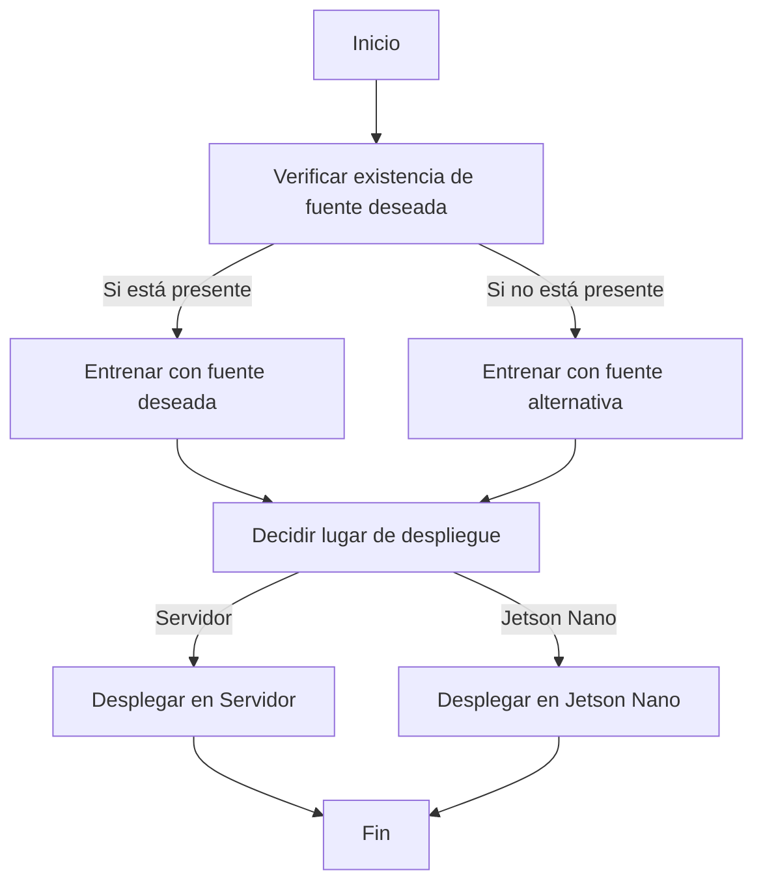

---

### Descripción del Proceso de Entrenamiento y Despliegue:

**1. Inicio:** 
Aquí comienza el proceso.

**2. Verificar existencia de fuente deseada:** 
Antes de proceder con el entrenamiento, el sistema verifica si la fuente deseada para entrenar el modelo está disponible.

- **Si está presente:** El sistema procede con el entrenamiento utilizando la fuente deseada.

    **3. Entrenar con fuente deseada:** 
    En esta etapa, el sistema entrena el modelo usando la fuente específica que se deseaba.

- **Si no está presente:** Si la fuente deseada no está disponible, se recurre a una fuente alternativa.

    **4. Entrenar con fuente alternativa:** 
    El modelo se entrena utilizando una fuente alternativa en lugar de la originalmente deseada.

**5. Decidir lugar de despliegue:** 
Una vez finalizado el entrenamiento (ya sea con la fuente deseada o con la alternativa), se toma una decisión sobre dónde se desplegará el modelo: en un servidor convencional o en una Jetson Nano.

- **Servidor:** Si se decide desplegar en un servidor:

    **6. Desplegar en Servidor:** 
    Aquí, el modelo entrenado se despliega y pone en marcha en un servidor.

- **Jetson Nano:** Si se decide desplegar en una Jetson Nano:

    **7. Desplegar en Jetson Nano:** 
    En esta etapa, el modelo se despliega y se pone en marcha en una Jetson Nano.

**8. Fin:** 
Independientemente de dónde se haya desplegado el modelo, al finalizar el despliegue, el proceso llega a su fin.

---

## poner el link de otro abajo 

[Ver Proceso planteado](pres.md)