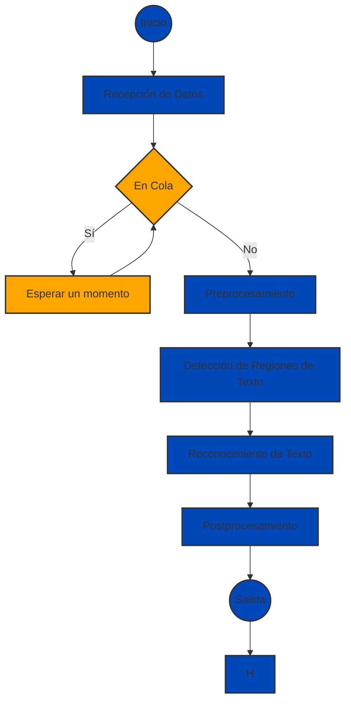

---

### Descripción del Proceso de OCR:

**1. Inicio:** 
Este es el punto de partida de todo el proceso.

**2. Recepción de Datos:** 
Aquí, el sistema recibe los datos o imágenes que se desean procesar. Estos datos podrían provenir de diferentes fuentes, como un sistema de gestión de documentos, un escáner, una cámara, entre otros.

**3. ¿En Cola?:** 
Tras la recepción de datos, el sistema verifica si hay una cola de procesamiento pendiente. La cola sirve como un buffer que regula el flujo de datos hacia las etapas de procesamiento, especialmente útil si se manejan grandes volúmenes de datos.

- **Sí (en cola):** Si hay datos en la cola esperando ser procesados, el sistema entra en un estado de espera.

    **Esperar un momento:** 
    El sistema se pausa temporalmente para no saturar los recursos de procesamiento y garantizar que todos los datos sean manejados adecuadamente. Una vez transcurrido este periodo, el sistema vuelve a verificar la cola.

- **No (no en cola):** Si no hay datos en espera, el proceso continúa hacia la siguiente etapa.

**4. Preprocesamiento:** 
Antes de realizar la detección y el reconocimiento del texto, los datos se someten a una fase de preprocesamiento. Esto puede incluir ajustes de iluminación, corrección de inclinaciones, eliminación de ruido, entre otros. El objetivo es preparar la imagen para que las etapas siguientes sean más precisas y efectivas.

**5. Detección de Regiones de Texto:** 
En esta etapa, el sistema identifica y demarca las áreas dentro de la imagen que contienen texto. 

**6. Reconocimiento de Texto:** 
Aquí, el sistema interpreta el texto dentro de las regiones detectadas, convirtiendo las imágenes de texto en texto legible y utilizable.

**7. Postprocesamiento:** 
Después del reconocimiento, el texto se somete a una fase de postprocesamiento. Esto puede incluir correcciones ortográficas, validación de formato, entre otros, para garantizar que el texto reconocido sea lo más preciso posible.

**8. Salida:** 
Finalmente, el texto procesado se envía como salida, que podría ser guardado en una base de datos, mostrado al usuario, entre otros posibles destinos.

---
